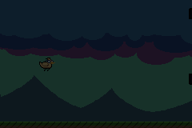

# Kadu Bird
A game developed in C++ for the Nintendo Game Boy Advance, and yes... 
it's a copy of flappy bird =)

 

Download the ROM from the [itchio page](https://atsxp.itch.io/kadu-bird)

## Why?
I made this game for two reasons, to honor one of my best friends, to 
study more about the hardware and development on the GBA and to be able 
to create something playable.

## Tested emulators
These are the emulators I've tested and approved, feel free to use one of 
your choice.

- [mGBA](https://mgba.io/downloads.html) - version 0.10.2 (Windows, Mac, Linux, and more...)
- [VisualBoyAdvance](https://visualboyadvance.org/download/) - version 1.8.0 (Windows, Mac, Linux)
- [My Boy!](https://play.google.com/store/apps/details?id=com.fastemulator.gbafree&hl=pt_BR&gl=US) - version 2.0.6 (Android)

## Build
To compile the ROM is quite simple.
Prerequisites:

- DevKitARM - generate the ROM
- [Grit](https://www.coranac.com/man/grit/html/grit.htm)  - convert the graphics
- [Maxmod](https://maxmod.devkitpro.org/) - convert the audio files

Luckily, [Devkitpro](https://devkitpro.org/wiki/Getting_Started) provides an 
environment with the programs required above, complete for the development of 
several consoles, including the GBA, just go to their website and follow the 
installation instructions.

After installing the requirements, go to the folder where the *Kadu Bird* files 
are located and run `make` on the command line.

Compiled ROM, ready to play =)
